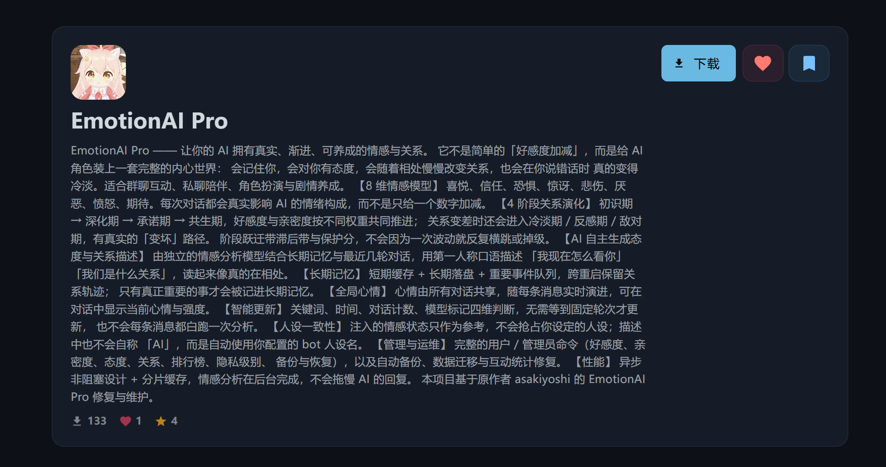

# EmotionAI Pro - 融合版情感智能插件 v4.1.1

> 融合 [EmotionAI](https://github.com/tengtian3/astrbot-plugin-emotionai) 与 [FavourPro](https://github.com/Catfish872/astrbot_plugin_favourpro) 精华，并加入「智能更新 · 辅助 LLM · 长期记忆 · 负好感支持 · 过渡保护」五大革新，打造**真实、渐进、可养成**的 AI 情感交互系统。

> 本项目基于原作者 **asakiyoshi** 开发的 EmotionAI Pro 修复维护。原仓库长期未更新，**部分修复已向上游仓库提交 PR**；为便于用户正常使用，在此仓库持续维护并发布。

---

## 更新日志

### v4.1.1（老用户关系阶段显示修复）

- 修复一部分老用户（存档被修复过、或从更早版本升级上来）面板「关系阶段」显示成初识期的问题：现在按实际分数归档到正确的上一阶段，亲密度门槛也按目标阶段正常生效，随后的互动会正常完成过渡；
- 修复存档损坏时数值被静默清零：逐字段抢救真正生效，修复后直接返回修复后的状态，不再回退成新用户。

### v4.1.0（会话边界上下文保鲜 + 一批修复）

长时间没聊之后再开口，bot 不再翻旧账：距上次活跃超过设定间隔时，本轮对话
从零开始，不再带着几天前的话题上下文（会话记录本身不受影响，可在 WebUI 查看）。

| 配置项 | 默认值 | 说明 |
|---|---|---|
| `session_gap_minutes` | `60` | 会话间隔超过多少分钟则丢弃本轮旧对话历史；填 `0` 关闭，恢复框架默认行为 |

其它修复：

- `/关系阶段`：亲密度不够卡住过渡时，状态不再误显示「正在适应新阶段」，改为显示目标阶段与还差多少点；
- `/好感度`：过渡期信息的冒号统一为全角，与面板风格一致；
- 修复健康检查异常被静默吞掉、无法定位的问题，清理若干死代码。

### v4.0.23（分阶段亲密度门槛）

v4.0.22 的统一门槛只有一个固定数值，对第二、三次过渡形同虚设（承诺期的权重
决定了复合分冲到阈值本身就要求亲密度 ≥72）。现改为按目标阶段分别设置，
每次过渡各按各的档位生效。

| 配置项 | 默认值 | 说明 |
|---|---|---|
| `stage_intimacy_gates` | `{"DEEPENING": 20, "COMMITMENT": 40, "SYMBIOSIS": 60}` | 分阶段门槛：key 是目标阶段（第二/三/四阶段），值是占最大亲密度的百分比，上限 200 时即 40 / 80 / 120 |

- 各档门槛随「最大亲密度」配置一起缩放，无写死的绝对数值；
- 阶段不在表里则回退统一门槛 `transition_intimacy_pct`（老配置行为不变）；
- 某一档填 `0` 只关闭该段门槛；
- 过渡被卡住时，「还差多少点」按被挡住那个阶段的档位计算，与过渡加成同口径。

### v4.0.22（亲密度成为过渡门槛 + 里程碑加成）

亲密度从「每轮小幅波动的附赠数值」升级为一条真正有分量的规则：它决定关系能不能往前
走，也决定好感度在过渡期是否还在变化。好感度本身的规则保持不变。

**1. 阶段过渡新增亲密度门槛（默认 50%）**

复合评分达到下一阶段阈值只是**必要条件**——亲密度还必须达到
「亲密度上限 × 百分比」（默认 50%）才能完成过渡。

| 配置项 | 默认值 | 说明 |
|---|---|---|
| `transition_intimacy_pct` | `50` | 过渡所需亲密度占最大亲密度的百分比，填 `0` 关闭门槛 |

- 未达标时过渡会**卡住**：面板、`/好感度`、进阶建议都会显示「还差多少点」；
- 一旦亲密度达标，下一轮互动即完成过渡，不会跳过也不会重复发放过渡加成；
- 门槛跟着「亲密度上限」配置走，上限改了门槛自动跟着变；
- 负好感路径（冷淡期 / 反感期 / 敌对期）不受门槛影响。

**2. 未达标期间好感度不变化**

过渡被亲密度卡住时，本轮好感度变化会被冻结，不再出现「分在涨、阶段却不动」的割裂感。
亲密度的变化与下文两类里程碑加成**不受影响**——那正是用来突破门槛的通道。

**3. 亲密度里程碑：让亲密度不必只靠打分缓慢积累**

日常的单次变化幅度仍由用户配置（v4.0.21 起）。在此之外新增两类规则明确的加成：

| 配置项 | 默认值 | 说明 |
|---|---|---|
| `intimacy_first_deep_bonus` | `3` | 首次深度交流的一次性亲密度奖励 |
| `intimacy_streak_days` | `3` | 连续互动多少天开始获得加成 |
| `intimacy_streak_bonus` | `1` | 连续达标后每天首次互动的加成 |

- **首次深度交流**：单轮互动的情感意义分达到阈值时发一次，落盘防重复，重启不重发；
- **连续多日互动**：按本地日期计算连击，中断则重新累计；达标后每天首次互动都有加成，
  同一天多次互动不重复发奖；
- 两项填 `0` 即关闭，加成钳制在亲密度上下限之内。

**4. `/好感度` 命令在过渡期展示亲密度进度**

过渡期查询会额外显示亲密度当前值、达标线与差值，未达标时明确提示「好感度不会变化」。

**5. 其它**

- 新增 29 项自动化测试，覆盖门槛阻断与持续、达标放行、好感度冻结、里程碑防重复、
  关闭分支与配置三处同步；全量 349 项通过。

### v4.0.21（亲密度幅度可配置 + 关系阶段名称自定义）

回应两个使用诉求：把写死的数值改成可配置项，并让关系阶段的显示名称可以自定义。

**1. 亲密度的单次增减幅度改为可配置（默认 ±3）**

原来亲密度每次变化被代码写死为 ±5。现新增两个配置项，可在 WebUI 用滑块调整：

| 配置项 | 默认值 | 说明 |
|---|---|---|
| `intimacy_change_min` | `-3` | 亲密度单次减少的最大幅度（填负数） |
| `intimacy_change_max` | `3` | 亲密度单次增加的最大幅度（填正数） |

- 三条更新路径（LLM 解析 / 本地兜底 / 紧急兜底）**全部**受这对配置约束，不会再出现「配置改了但某条路径仍按旧值钳制」的情况；
- 好感度的对应幅度（`change_min` / `change_max`）语义不变，互不影响；
- 填反或越界时自动修复为默认值，不会牵连其它配置。

**2. 关系阶段名称可自定义（含冷淡期 / 反感期 / 敌对期）**

7 个关系阶段（初识期、深化期、承诺期、共生期、冷淡期、反感期、敌对期）的
**显示名称**现在都可以在配置里改成你想要的名字，例如把「初识期」改成
「初见」、「共生期」改成「灵魂伴侣」。

- 配置界面按阶段分组、逐项填写，留空则用默认名；
- 升级前的老存档**不会**因为改名而被重置——旧默认名会自动映射到新名称；
- 面板、进阶建议、过渡提示等所有显示位置同步跟随新名称。

**3. 其它**

- 配置校验漏斗补上亲密度这一对（与好感度同一机制）；
- 新增 46 项自动化测试，全量 320 项通过。

### v4.0.20（接通 6 个「死配置」+ 不再因单个坏字段丢掉整份配置）

用户反馈「单次好感度减少的最大数值设成 3 好像没生效」，顺着查出一批配置项
在界面上能填、能保存，但从来没有被任何代码读取过。本次把它们全部接通，
并修掉一个会让整个配置界面「改不动」的陷阱。

1. **接通 6 个死配置**：好感度单次增减幅度、情感意义门槛、插件处理优先级、
   FavourPro 态度系统开关、AI 自主生成文本开关——现在都按配置真实生效。
2. **配置校验改为逐字段修复**：以前只要有一对数值填反就整份配置判定失败并丢弃，
   导致「改什么都保存不上」；现在只把填反的那一对重置为默认值，其余照常生效。
3. **顺带把配置说明文案写清楚了**，如「好感度单次减少的最大幅度（填负数，例如 -3）」。
4. 新增 22 项自动化测试，覆盖上述每个配置项的真实生效路径。

历史版本（v4.0.19 及更早，点击展开）

| 版本 | 概要 |
|------|------|
| v4.0.19 | 修复「配置里的数值上限不生效」（插件内部另有一份硬编码边界）；另修存档损坏时数据被静默清零、数据修复实为清零、过渡状态不落盘三个数据安全缺陷 |
| v4.0.18 | 修复「配置界面设了管理员却提示权限不足」——根因是单个越界字段导致整份配置回退默认值，改为逐字段回退并完整记录出错字段 |
| v4.0.17 | 日志规范合规：内置 `logging` 与 10 个文件 182 处 `print()` 全部改用 AstrBot 官方 logger |
| v4.0.15 | 缓存哈希两级兜底（xxhash 异常不再炸穿消息链路）；修复 bot_name 自动提取漏 `await` 导致的静默失效 |
| v4.0.14 | 情感分析接通退避链：45 秒总预算内依次尝试辅助 LLM → 主 LLM → 回退模型表 |
| v4.0.13 | `/查看好感` 首行「用户」重复两次的显示层修复 |
| v4.0.12 | 情感分析转入后台执行，回复收尾钩子从 7~11 秒降到毫秒级 |
| v4.0.11 | 修复注入的「你是一个 AI 助手」与人设「你不是 AI」冲突导致的人格漂移 |
| v4.0.10 | 修复 xxhash ≥ 4.0 未 encode 导致分片缓存整体崩溃；修复情感分析模型选择完全失效 |
| v4.0.9 | 主导情感判定、心情信号提取、缓存清理等性能优化（约快 10~30%） |
| v4.0.8 及更早 | 心情实时演进、共同心情、缓存命中率修复、好感度永不更新等多个问题修复，详见 git 提交历史 |

---

## 核心亮点

| 特性类别 | 亮点说明 |
|----------|----------|
| **双重情感系统** | 保留 8 维情感 + 好感/亲密度双核，新增「复合评分」「动态权重」与「负好感专属权重」 |
| **真实心理模拟** | AI 自主生成态度/关系描述，新增「辅助 LLM 情感分析专家」与「长期记忆轨迹」，避免数值跳变 |
| **关系阶段系统** | 四阶段（初识→深化→承诺→共生）+ 负向三档（冷淡/反感/敌对），阶段名称可自定义；新增「滞后带过渡保护」「亲密度增益」与「阶段进度百分比」 |
| **智能更新机制** | 不再依赖尾部标记：①关键词情绪强度 ②时间阈值 ③强制计数器 ④主 LLM 标记 四维决策 |
| **高交互性** | 排行榜、阶段分析、情感档案、隐私控制，新增「缓存统计」「数据备份/修复」「调试事件/记忆」 |
| **隐私与性能** | TTL 缓存、异步自动保存、数据迁移、全局隐私级别，新增「负好感惩罚」「抵御操纵提示」 |

---

## 使用指南

### 用户命令

| 命令 | 说明 |
|------|------|
| `/好感度` | 查看当前情感状态（群聊显示用户标识，含过渡进度） |
| `/状态显示` | 切换是否在对话后显示状态信息 |
| `/好感排行 [n]` | 查看 TOP n 情感排行榜（最多 20） |
| `/负好感排行 [n]` | 查看 BOTTOM n 情感排行榜 |
| `/关系阶段` | 显示当前阶段、动态权重、过渡状态与进阶建议 |
| `/缓存统计` | 查看缓存命中率、条目数、访问次数 |

### 管理员命令

| 命令 | 说明 |
|------|------|
| `/设置好感 <ID> <val>` | 设置好感度（-100~100） |
| `/设置亲密 <ID> <val>` | 设置亲密度（0~100） |
| `/设置态度 <ID> <文本>` | 自定义态度描述 |
| `/设置关系 <ID> <文本>` | 自定义关系描述 |
| `/重置好感 <ID>` | 重置为默认值 |
| `/查看好感 <ID>` | 查看完整档案（含维度、过渡、记忆） |
| `/隐私级别 <0-2>` | 0=完全保密 1=基础 2=详细 |
| `/重置插件` | 清空所有数据 |
| `/备份数据` | 创建快照（含长期记忆） |
| `/修复互动统计` | 依据好感/亲密度自动修正正负互动次数 |
| `/调试事件` | 输出事件结构（排障） |
| `/调试记忆` | 查看短期缓存与长期记忆详情 |

---

## 配置说明（`_conf_schema.json`）

| 配置键 | 说明 | 默认值 |
|--------|------|--------|
| `enable_attitude_system` | 启用 FavourPro 态度关系系统 | `true` |
| `enable_ai_text_generation` | AI 自主生成态度/关系描述 | `true` |
| `enable_secondary_llm` | 启用辅助 LLM 做情感分析 | `true` |
| `enable_smart_update` | 四维智能更新（关键词+时间+计数+标记） | `true` |
| `force_update_interval` | 强制更新间隔（对话次数） | `5` |
| `emotional_significance_threshold` | 记入长期记忆的分数阈值 | `5` |
| `global_privacy_level` | 全局隐私级别（0~2） | `1` |
| `session_based` | 是否按会话隔离情感 | `false` |

### 动态权重与过渡保护

| 阶段 | 好感权重 | 亲密权重 | composite 阈值 | 过渡缓冲 | 亲密度增益 |
|------|----------|----------|-----------------|----------|------------|
| 初识期 | 70 % | 30 % | 25 | 3 分 | ×4.0 |
| 深化期 | 50 % | 50 % | 55 | 5 分 | ×3.6 |
| 承诺期 | 30 % | 70 % | 80 | 7 分 | ×3.0 |
| 共生期 | 50 % | 50 % | 95 | 10 分 | ×1.0 |

- **滞后带**：上升阈值 > 下降阈值，防止阶段抖动
- **保护分**：过渡期间复合评分不会低于前一段最高值
- **增益**：过渡期亲密度成长倍率提升，助力平滑进阶

---

## 设计理念

> 不是简单“好感度加减”，而是「**真实·渐进·可养成·可运维**」的 AI 内心世界。

### 保留

- 8 维情感模型与异步高性能架构
- AI 自主文本评估与真实心理模拟
- 完备管理工具与排行榜体系

### 新增

1. **智能更新**：四维判断（关键词/时间/计数/LLM 标记），无需等待尾部标记
2. **辅助 LLM**：独立情感分析专家，结合长期记忆与最近 3 轮对话，第一人称口语生成态度/关系描述
3. **长期记忆**：短期 TTL + 长期落盘 + 重要事件队列，跨重启保留关系轨迹
4. **负好感支持**：负好感阶段专属权重（好感 100 %）与描述策略，支持“冷淡/反感/敌对”三档
5. **过渡保护**：滞后带 + 保护分 + 亲密度增益，阶段跃迁平滑不掉级
6. **缓存与备份**：TTL 命中率统计、自动保存、数据备份与迁移、互动统计修复
7. **隐私与运维**：全局隐私级别、抵御操纵提示、调试事件/记忆指令、异步锁粒度优化

---

## 结语

**EmotionAI Pro** 不只是一个“好感度插件”，而是一个：

> **真实可养成的 AI 内心世界**
> **渐进式关系演进系统**
> **高可用情感交互框架**

无论是群聊互动、私聊陪伴，还是角色扮演、剧情养成，都能让你的 AI 拥有**细腻、自然、可持续**的情感表达与关系变化。
